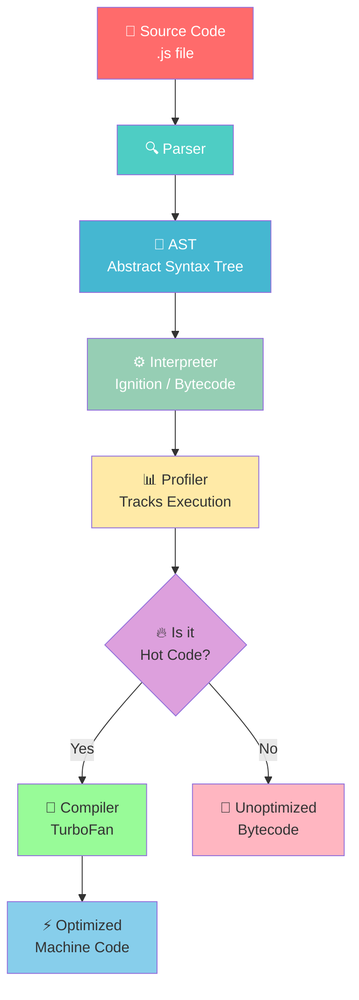
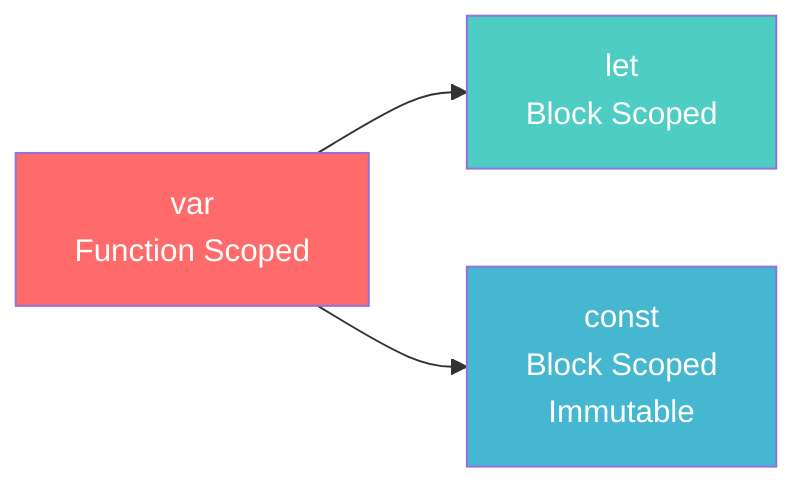
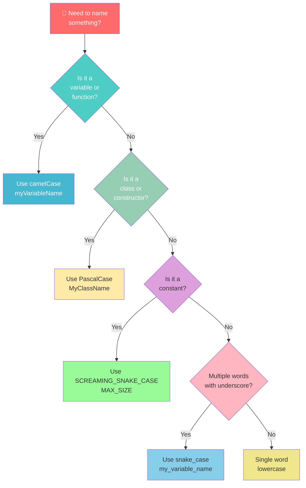
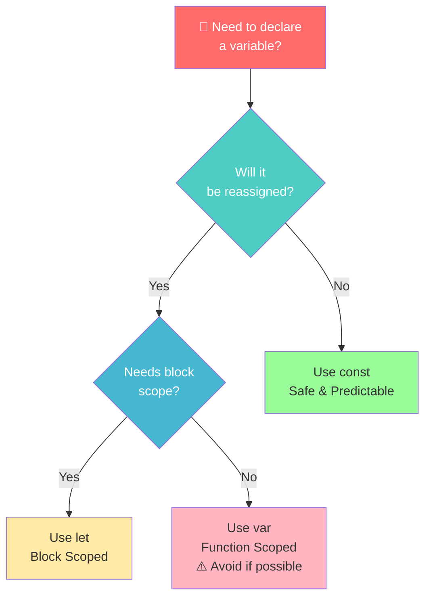
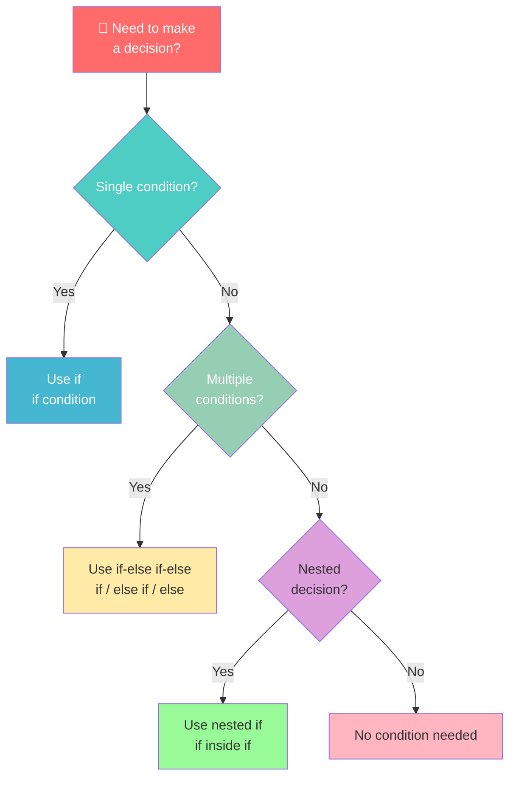
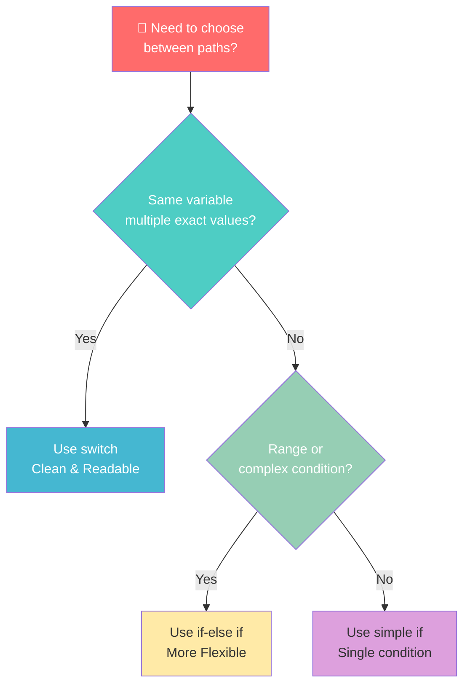
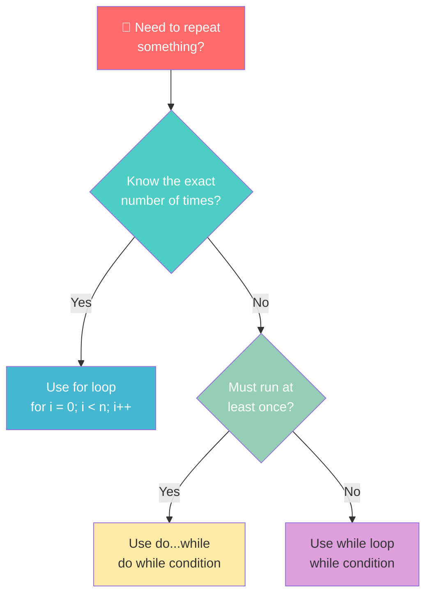
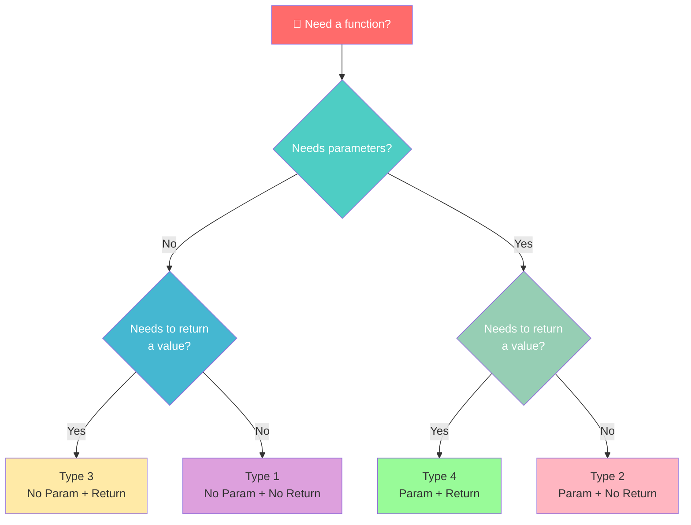

<div align="center">

# 🎭 PlaywrightWithAI

### *Master JavaScript Fundamentals — One Chapter at a Time!*

[](https://developer.mozilla.org/en-US/docs/Web/JavaScript)
[](https://nodejs.org/)
[](https://playwright.dev/)
[](LICENSE)

</div>

---

## 🌟 Welcome!

Welcome to **PlaywrightWithAI** — a hands-on, chapter-by-chapter learning repository that takes you from JavaScript basics to advanced concepts. Whether you're just starting out or brushing up on fundamentals, this repo is structured to make your learning journey **progressive**, **interactive**, and **fun**! 🚀

---

## 📚 Learning Roadmap

```mermaid
graph LR
    A[🚀 Chapter 01<br/>Basics] --> B[📘 Chapter 02<br/>JS Syntax]
    B --> C[🏷️ Chapter 03<br/>Identifiers]
    C --> D[📦 Chapter 04<br/>JavaScript Concepts]
    D --> E[⚡ Chapter 05<br/>Literals]
    E --> F[🔢 Chapter 06<br/>Operators]
    F --> G[🌿 Chapter 07<br/>If / Else]
    G --> H[🔀 Chapter 08<br/>Switch]
    H --> I[⌨️ Chapter 09<br/>User Input]
    I --> J[🔄 Chapter 10<br/>Loops]
    J --> K[📋 Chapter 11<br/>Arrays]
    K --> L[⚙️ Chapter 12<br/>Functions]

    style A fill:#FF6B6B,color:#fff
    style B fill:#4ECDC4,color:#fff
    style C fill:#45B7D1,color:#fff
    style D fill:#96CEB4,color:#fff
    style E fill:#FFEAA7,color:#333
    style F fill:#DDA0DD,color:#333
    style G fill:#FF6B6B,color:#fff
    style H fill:#4ECDC4,color:#fff
    style I fill:#45B7D1,color:#fff
    style J fill:#96CEB4,color:#fff
    style K fill:#FFEAA7,color:#333
    style L fill:#DDA0DD,color:#333
```



---

## 📂 Repository Structure

| 📁 Chapter | 🗂️ Folder | 📝 Description |
|:----------:|:----------|:--------------|
| **Chapter 01** | `chapter_01_Basics` | Variables, `console.log`, hot code optimization 🔥, and Node.js setup verification |
| **Chapter 02** | `chapter_02_JavaScript_Basics` | Core JS syntax — `var`, reassignment, and logging |
| **Chapter 03** | `chapter_03_Identifierand _literal` | Naming rules, conventions, comments 💬, and VS Code shortcuts ⌨️ |
| **Chapter 04** | `chapter_04_Javascript_Concepts` | Functions, `var`/`let`/`const` scope, and variable declarations 🧠 |
| **Chapter 05** | `chapter_05_Literal` | Literals — numbers, strings, booleans, null, undefined, and template literals 📜 |
| **Chapter 06** | `chapter_06_Operator` | Operators — arithmetic, assignment, comparison, logical, ternary, increment/decrement 🔢 |
| **Chapter 07** | `chapter_07_If_else` | Conditional statements — `if`, `else if`, `else`, nested conditions, truthy/falsy 🌿 |
| **Chapter 08** | `chapter_08_Switch_Statement` | Switch statements — `case`, `break`, `default`, grouped cases, real-world examples 🔀 |
| **Chapter 09** | `chapter_09_UserInput_NeverUsed` | User input techniques — `prompt`, `readline`, and `prompt-sync` ⌨️ |
| **Chapter 10** | `chapter_10_Loop` | Loops — `for`, `while`, `do...while`, nested loops, and interview questions 🔄 |
| **Chapter 11** | `chapter_11_Arrays` | Arrays — creation, access, methods, searching, iteration, sorting, slicing 📋 |
| **Chapter 12** | `chapter_12_Functions` | Functions — declarations, expressions, arrow functions, parameters, and return values ⚙️ |

---

## 🚀 Quick Start

### Prerequisites
- ✅ [Node.js](https://nodejs.org/) installed (v14 or higher recommended)
- ✅ A code editor (VS Code recommended)
- ✅ Curiosity to learn! 🧠

### Running Examples

Each chapter contains standalone `.js` files. Open your terminal and run:

```bash
# 🎯 Chapter 01 — Basics
node chapter_01_Basics/01_Basics.js
node chapter_01_Basics/02_HotCode.js
node chapter_01_Basics/03_Js_Verify_Setup.js

# 📘 Chapter 02 — JavaScript Basics
node chapter_02_JavaScript_Basics/05_JS_Basics.js

# 🏷️ Chapter 03 — Identifiers & Literals
node "chapter_03_Identifierand _literal/06_Identifier_Rules.js"
node "chapter_03_Identifierand _literal/js_Identifier_rule.js"

# 📦 Chapter 04 — JavaScript Concepts
node chapter_04_Javascript_Concepts/09_functions.js
node chapter_04_Javascript_Concepts/10_variable_explained.js
node chapter_04_Javascript_Concepts/11_let_explained.js
node chapter_04_Javascript_Concepts/12_const_explained.js
node chapter_04_Javascript_Concepts/13_var_functionscope.js
node chapter_04_Javascript_Concepts/14_let_scope.js

# 📜 Chapter 05 — Literals
node chapter_05_Literal/22_Literal.js
node chapter_05_Literal/23_null_undefined.js
node chapter_05_Literal/24_null.js
node chapter_05_Literal/25_Literal_All.js
node chapter_05_Literal/26_Literal_Number_all.js
node chapter_05_Literal/27_String.js
node chapter_05_Literal/28_Template_Literal.js
node chapter_05_Literal/29_Backtick_single_double.js

# 🔢 Chapter 06 — Operators
node chapter_06_Operator/30_Assignment_Operator.js
node chapter_06_Operator/31_Arithmetic_Operator.js
node chapter_06_Operator/32_modulus_Operator.js
node chapter_06_Operator/33_Exponential_OP.js
node chapter_06_Operator/34_compound_OP_IQ.js
node chapter_06_Operator/35_Comparison_OP.js
node chapter_06_Operator/36_Comparison_Strict_Loose_OP.js
node chapter_06_Operator/37_IQ_loose_Strict.js
node chapter_06_Operator/38_Confusing_Comprison.js
node chapter_06_Operator/39_Logical_Op.js
node chapter_06_Operator/40_String_Con_OP.js
node chapter_06_Operator/41_Ternary_OP.js
node chapter_06_Operator/42_Tyoe_OP.js
node chapter_06_Operator/43_Null_OP.js
node chapter_06_Operator/44_Incre_Decre_OP.js
node chapter_06_Operator/45_PostInscrement_OP.js
node chapter_06_Operator/46_IQ_Increment_Op.js
node chapter_06_Operator/47_Advance_IncDec.js

# 🌿 Chapter 07 — If / Else
node chapter_07_If_else/48_IF_Else.js
node chapter_07_If_else/49_If_elseif_else.js
node chapter_07_If_else/50_REAL_IF_ELSE.js
node chapter_07_If_else/51_API_IF_ELSE.js
node chapter_07_If_else/52_IQ_IF_ELSE.js
node chapter_07_If_else/53_IF_ELSE_real.js
node chapter_07_If_else/54_IQ.js
node chapter_07_If_else/55_IE.js
node chapter_07_If_else/56_IQ_EVEN_ODD.js
node chapter_07_If_else/57_Grade_Calc.js
node chapter_07_If_else/58_LEAP_YEAR.js
node chapter_07_If_else/1_Assignment.js
node chapter_07_If_else/2_Assignment.js
node chapter_07_If_else/3_Assignment.js
node chapter_07_If_else/4_Assignment.js
node chapter_07_If_else/5_Assignment.js
node chapter_07_If_else/6_Assignment.js
node chapter_07_If_else/7_Assignment.js

# 🔀 Chapter 08 — Switch Statement
node chapter_08_Switch_Statement/59_Switch.js
node chapter_08_Switch_Statement/60_No_break.js
node chapter_08_Switch_Statement/61_Default.js
node chapter_08_Switch_Statement/62_Real_Time_Example.js
node chapter_08_Switch_Statement/63_Switch_Group.js
node chapter_08_Switch_Statement/64_IQ.js
node chapter_08_Switch_Statement/65_IQ2.js
node chapter_08_Switch_Statement/66_IQ3.js
node chapter_08_Switch_Statement/67_IQ4.js

# ⌨️ Chapter 09 — User Input
node chapter_09_UserInput_NeverUsed/68_User_Input.js
node chapter_09_UserInput_NeverUsed/69.Node_readline.js
node chapter_09_UserInput_NeverUsed/70_prompt_sync.js

# 🔄 Chapter 10 — Loops
node chapter_10_Loop/71_For_Loop.js
node chapter_10_Loop/72_For_Loop.js
node chapter_10_Loop/73_For_Loop2.js
node chapter_10_Loop/74_For_Loop_IQ.js
node chapter_10_Loop/75_While_Loop.js
node chapter_10_Loop/76_Do_While_loop.js
node chapter_10_Loop/77_Do_While_loop2.js
node chapter_10_Loop/78_IQ.js
node chapter_10_Loop/79_IQ.js
node chapter_10_Loop/80_IQ.js
node chapter_10_Loop/81_IQ.js

# 📋 Chapter 11 — Arrays
node chapter_11_Arrays/82_Arrays.js
node chapter_11_Arrays/83_Arrays.js
node chapter_11_Arrays/84_Access_Array.js
node chapter_11_Arrays/85_Arrays_adding_Remove.js
node chapter_11_Arrays/86_adding_Remove2.js
node chapter_11_Arrays/87_Real_Example.js
node chapter_11_Arrays/89_Searching.js
node chapter_11_Arrays/90_Iterate.js
node chapter_11_Arrays/91_Transform_Array.js
node chapter_11_Arrays/92_Array_Sorting.js
node chapter_11_Arrays/93_Array_Slicing.js
node chapter_11_Arrays/94_Concat_Array.js
node chapter_11_Arrays/95_Array_Checking.js

# ⚙️ Chapter 12 — Functions
node chapter_12_Functions/96_Functions.js
node chapter_12_Functions/97_Type1_Fn_Basic_Functions.js
node chapter_12_Functions/98_Type2_Fn_With_Param_No_Return.js
node chapter_12_Functions/99_Type3_Fn_No_param_Return_type.js
node chapter_12_Functions/100_Type4_Fn_With_Param_With_Return.js
node chapter_12_Functions/101_Templte_literal.js
node chapter_12_Functions/102_Fn_expression.js
node chapter_12_Functions/103_Arrow_Fn.js
node chapter_12_Functions/93_Arrow_Fn.js
```

> 💡 **Pro Tip:** Use the VS Code shortcut cheat sheets in Chapter 03 to speed up your workflow!

---

## 🔍 Chapter Deep Dive

### 📗 Chapter 01 — Basics
> *"Every expert was once a beginner."* 🌱

| File | What You'll Learn |
|:-----|:-----------------|
| `01_Basics.js` | 🧮 Declaring variables with `let`, printing with `console.log` |
| `02_HotCode.js` | 🔥 How JS engines optimize **hot code** through the pipeline |
| `03_Js_Verify_Setup.js` | 🖥️ Checking your OS, architecture, and Node version |

#### 🔥 JavaScript Engine Optimization Pipeline

When you run JavaScript, the engine doesn't just execute line by line. It **optimizes** frequently used code! Here's how:



**💡 What's happening?**
1. **Parser** reads your code and checks for syntax errors
2. **AST** (Abstract Syntax Tree) is a tree representation of your code
3. **Interpreter** quickly generates bytecode to start execution
4. **Profiler** watches which functions run frequently
5. If code is "hot" (runs often), the **Compiler** optimizes it into fast machine code!

---

### 📘 Chapter 02 — JavaScript Basics
> *"Syntax is the grammar of programming."* 📝

| File | What You'll Learn |
|:-----|:-----------------|
| `05_JS_Basics.js` | 📦 Declaring variables with `var`, re-declaration, and console output |

#### 🎯 Variable Declaration Evolution



> ⚠️ **Best Practice:** Modern JavaScript prefers `let` and `const` over `var` to avoid scope-related bugs!

---

### 📙 Chapter 03 — Identifiers and Literals
> *"Good names make code self-documenting."* 🏷️

| File | What You'll Learn |
|:-----|:-----------------|
| `06_Identifier_Rules.js` | ✅ Valid vs ❌ Invalid identifier examples |
| `07_Identifier_part2.js` | 🎨 Naming conventions across different styles |
| `08_Comment.js` | 💬 Single-line, multi-line, and JSDoc comments |
| `js_Identifier_rule.js` | 📖 Comprehensive guide with all rules and examples |
| `VS_Code_keyboard_shortcut_mac.md` | ⌨️ macOS shortcuts cheat sheet |
| `VS_Code_keyboard_shortcut_windows.md` | ⌨️ Windows shortcuts cheat sheet |

#### 🏷️ Identifier Naming Decision Tree



#### 📋 Naming Conventions Cheat Sheet

| 🎨 Convention | 📖 Used For | 📝 Example |
|:-------------|:-----------|:----------|
| `camelCase` | Variables & Functions | `userName`, `getUserInfo()` |
| `PascalCase` | Classes & Constructors | `UserProfile`, `ShoppingCart` |
| `snake_case` | Variables (optional) | `user_name`, `total_price` |
| `SCREAMING_SNAKE_CASE` | Constants | `MAX_SIZE`, `API_KEY` |
| `Hungarian Notation` | Type-prefixed (older) | `strName`, `bActive`, `nCount` |

#### 🚦 Identifier Rules Traffic Light

| 🟢 DO | 🔴 DON'T |
|:------|:---------|
| Start with letter, `_`, or `$` | Start with a number `123var` |
| Use letters, numbers, `_`, `$` after first char | Use spaces `my var` |
| Be descriptive `totalPrice` | Use reserved words `let class` |
| Respect case sensitivity `myVar` ≠ `myvar` | Use special chars `@`, `#`, `!` |
| Use Unicode `café`, `变量` | Use hyphens `my-name` |

#### 💬 Comment Styles

```javascript
// 🟢 Single-line comment — quick notes

/*
 * 🟡 Multi-line comment — detailed explanations
 * Author: Pramod Dutta
 * Date: 14-Feb-2026
 */

/**
 * 🔵 JSDoc comment — for documentation
 * @param {string} name - The user's name
 * @returns {string} Greeting message
 */
```

---

### 📕 Chapter 04 — JavaScript Concepts
> *"Understanding scope is understanding JavaScript."* 🧠

| File | What You'll Learn |
|:-----|:-----------------|
| `09_functions.js` | 🎯 Defining and calling functions in JavaScript |
| `10_variable_explained.js` | 📦 `var` scope, reassignment, and redeclaration behavior |
| `11_let_explained.js` | 🅰️ `let` block-scope, reassignment, and temporal dead zone |
| `12_const_explained.js` | 🔒 `const` immutability, block-scope, and common errors |
| `13_var_functionscope.js` | 🔍 How `var` hoisting works inside functions |
| `14_let_scope.js` | 🔍 How `let` block-scoping differs from `var` |

#### 🧠 Variable Scope Comparison



#### 📋 `var` vs `let` vs `const` Cheat Sheet

| 🏷️ Keyword | 🔁 Reassign? | 🔁 Redeclare? | 📦 Scope | ⚠️ Hoisting |
|:-----------|:-----------:|:------------:|:---------|:-----------|
| `var` | ✅ Yes | ✅ Yes | Function | Hoisted with `undefined` |
| `let` | ✅ Yes | ❌ No | Block | Hoisted but in TDZ |
| `const` | ❌ No | ❌ No | Block | Hoisted but in TDZ |

> ⚠️ **Best Practice:** Default to `const`, use `let` when reassignment is needed, and avoid `var` in modern JavaScript!

---

### 📜 Chapter 05 — Literals
> *"Literals are the raw values that power your code."* 📜

| File | What You'll Learn |
|:-----|:-----------------|
| `22_Literal.js` | 🔤 String, number, boolean, and object literals |
| `23_null_undefined.js` | ❓ Difference between `null` and `undefined` |
| `24_null.js` | 🕳️ Working with `null` values |
| `25_Literal_All.js` | 📖 Comprehensive overview of all literal types |
| `26_Literal_Number_all.js` | 🔢 Number literals, decimals, and special numeric values |
| `27_String.js` | 📝 String literals, escaping, and best practices |
| `28_Template_Literal.js` | 🧵 Template literals (backticks) and interpolation |
| `29_Backtick_single_double.js` | 🔄 Comparing single quotes, double quotes, and backticks |

---

### 🔢 Chapter 06 — Operators
> *"Operators are the verbs of programming."* 🔢

| File | What You'll Learn |
|:-----|:-----------------|
| `30_Assignment_Operator.js` | ⬅️ Assignment (`=`) and basic variable assignment |
| `31_Arithmetic_Operator.js` | ➕➖✖️➗ Addition, subtraction, multiplication, division |
| `32_modulus_Operator.js` | 🧮 Modulo (`%`) and remainder operations |
| `33_Exponential_OP.js` | 🚀 Exponentiation (`**`) operator |
| `34_compound_OP_IQ.js` | 🧩 Compound assignment operators (`+=`, `-=`, etc.) |
| `35_Comparison_OP.js` | ⚖️ Comparison operators (`>`, `<`, `>=`, `<=`) |
| `36_Comparison_Strict_Loose_OP.js` | 🔍 Strict (`===`) vs loose (`==`) equality |
| `37_IQ_loose_Strict.js` | 🧠 Interview questions on equality comparisons |
| `38_Confusing_Comprison.js` | 😵 Confusing comparisons and type coercion traps |
| `39_Logical_Op.js` | 🔗 Logical operators (`&&`, `\|\|`, `!`) |
| `40_String_Con_OP.js` | 🔗 String concatenation with `+` and template literals |
| `41_Ternary_OP.js` | ❓ Ternary (`?:`) and nested ternary operators |
| `42_Tyoe_OP.js` | 🔍 `typeof` operator for type checking |
| `43_Null_OP.js` | 🕳️ Nullish coalescing (`??`) and optional chaining |
| `44_Incre_Decre_OP.js` | ⬆️⬇️ Increment (`++`) and decrement (`--`) operators |
| `45_PostInscrement_OP.js` | 🔄 Post-increment vs pre-increment behavior |
| `46_IQ_Increment_Op.js` | 🧠 Interview questions on increment operators |
| `47_Advance_IncDec.js` | 🚀 Advanced increment/decrement expressions |

---

### 🌿 Chapter 07 — If / Else
> *"Decisions are the hinges of destiny."* 🌿

| File | What You'll Learn |
|:-----|:-----------------|
| `48_IF_Else.js` | 🎯 Basic `if` and `else` syntax with a voting-age example |
| `49_If_elseif_else.js` | 📊 Using `else if` for multiple conditions — grade calculator |
| `50_REAL_IF_ELSE.js` | 🏗️ Nested `if` statements — login and role-based access control |
| `51_API_IF_ELSE.js` | 🌐 Handling API status codes with `if-else if-else` |
| `52_IQ_IF_ELSE.js` | 🧠 Truthy and falsy values in JavaScript conditions |
| `53_IF_ELSE_real.js` | 🔐 Real-world example — username, password, and account lock check |
| `54_IQ.js` | 🧩 Single-statement `if` without curly braces |
| `55_IE.js` | ⚠️ Understanding that `else` cannot exist without a matching `if` |
| `56_IQ_EVEN_ODD.js` | 🔢 Using the modulus operator with `if-else` to check even/odd |
| `57_Grade_Calc.js` | 🎓 Another grade calculator using `if-else if` chains |
| `58_LEAP_YEAR.js` | 📅 Leap year logic using logical (`&&`, `\|\|`) and comparison operators |

#### 🌿 If / Else Decision Tree



#### 📋 Truthy vs Falsy Cheat Sheet

| 🟢 Truthy Values | 🔴 Falsy Values |
|:-----------------|:----------------|
| Non-zero numbers (`1`, `-5`, `3.14`) | `0` |
| Non-empty strings (`"hello"`) | `""` (empty string) |
| Objects `{}` | `null` |
| Arrays `[]` | `undefined` |
| `true` | `NaN` |
| Functions | `false` |

> ⚠️ **Best Practice:** Always use strict equality (`===` and `!==`) in conditions to avoid unexpected type coercion!

---

### 🔀 Chapter 08 — Switch Statement
> *"Switch makes multiple paths crystal clear."* 🔀

| File | What You'll Learn |
|:-----|:-----------------|
| `59_Switch.js` | 🎯 Basic `switch` syntax with `case` and `break` |
| `60_No_break.js` | ⚠️ Fall-through behavior when `break` is omitted |
| `61_Default.js` | 🛡️ Using `default` for unmatched cases |
| `62_Real_Time_Example.js` | 🌐 Real-world API status code handling with `switch` |
| `63_Switch_Group.js` | 📦 Grouping multiple `case` labels together |
| `64_IQ.js` | 🧠 Interview questions on `switch` behavior |
| `65_IQ2.js` | 🧩 More tricky `switch` edge cases |
| `66_IQ3.js` | 🧩 Additional `switch` interview practice |
| `67_IQ4.js` | 🧩 Advanced `switch` scenarios |

#### 🔀 Switch vs If-Else Decision Tree



---

### ⌨️ Chapter 09 — User Input
> *"Programs come alive when they talk to users."* ⌨️

| File | What You'll Learn |
|:-----|:-----------------|
| `68_User_Input.js` | 🖱️ Browser `prompt()` for basic user input |
| `69.Node_readline.js` | 💻 Node.js `readline` module for CLI input |
| `70_prompt_sync.js` | 🔄 Synchronous prompts with `prompt-sync` |

> ⚠️ **Note:** This chapter covers input methods for learning purposes. In modern web apps, input is typically handled via HTML forms and APIs.

---

### 🔄 Chapter 10 — Loops
> *"Loops turn repetition into automation."* 🔄

| File | What You'll Learn |
|:-----|:-----------------|
| `71_For_Loop.js` | 🎯 Introduction to `for` loop syntax |
| `72_For_Loop.js` | 🔢 Counter-based `for` loop patterns |
| `73_For_Loop2.js` | 📊 Practical `for` loop exercises |
| `74_For_Loop_IQ.js` | 🧠 Interview questions on `for` loops |
| `75_While_Loop.js` | ⏳ `while` loop — condition-first iteration |
| `76_Do_While_loop.js` | 🔄 `do...while` — execute at least once |
| `77_Do_While_loop2.js` | 📈 More `do...while` practice |
| `78_IQ.js` | 🧩 Loop-based interview questions |
| `79_IQ.js` | 🧩 Nested loop patterns and logic |
| `80_IQ.js` | 🧩 Star patterns and number triangles |
| `81_IQ.js` | 🧩 Advanced loop challenges |

#### 🔄 Loop Selection Guide



---

### 📋 Chapter 11 — Arrays
> *"Arrays are the backbone of data collection in JavaScript."* 📋

| File | What You'll Learn |
|:-----|:-----------------|
| `82_Arrays.js` | 🎯 Creating arrays with mixed data types |
| `83_Arrays.js` | 📦 Array basics — indexing and `length` |
| `84_Access_Array.js` | 🔍 Accessing, updating, and traversing elements |
| `85_Arrays_adding_Remove.js` | ➕➖ `push`, `pop`, `shift`, `unshift` |
| `86_adding_Remove2.js` | 🛠️ More array manipulation methods |
| `87_Real_Example.js` | 🌐 Real-world array use cases |
| `89_Searching.js` | 🔎 `indexOf`, `includes`, `find` |
| `90_Iterate.js` | 🔄 `for`, `for...of`, `forEach`, `for...in` |
| `91_Transform_Array.js` | 🔄 `map`, `filter`, `reduce` transformations |
| `92_Array_Sorting.js` | 📊 `sort`, reverse sorting, and custom comparators |
| `93_Array_Slicing.js` | ✂️ `slice`, `splice`, and sub-array extraction |
| `94_Concat_Array.js` | 🔗 `concat` and spread operator for merging |
| `95_Array_Checking.js` | ✅ `Array.isArray` and type checking |

#### 📋 Array Methods Cheat Sheet

| 🛠️ Method | 📖 Purpose | 📝 Example |
|:----------|:----------|:----------|
| `push()` | Add to end | `arr.push(4)` |
| `pop()` | Remove from end | `arr.pop()` |
| `shift()` | Remove from start | `arr.shift()` |
| `unshift()` | Add to start | `arr.unshift(0)` |
| `indexOf()` | Find index of value | `arr.indexOf("x")` |
| `includes()` | Check if value exists | `arr.includes("x")` |
| `slice()` | Copy portion | `arr.slice(1, 3)` |
| `splice()` | Add/remove elements | `arr.splice(1, 1, "new")` |
| `map()` | Transform each element | `arr.map(x => x * 2)` |
| `filter()` | Keep matching elements | `arr.filter(x => x > 5)` |
| `forEach()` | Iterate with callback | `arr.forEach(console.log)` |

---

### ⚙️ Chapter 12 — Functions
> *"Functions are the building blocks of reusable code."* ⚙️

| File | What You'll Learn |
|:-----|:-----------------|
| `96_Functions.js` | 🎯 Defining and calling basic functions |
| `97_Type1_Fn_Basic_Functions.js` | 🏗️ Type 1: No parameters, no return value |
| `98_Type2_Fn_With_Param_No_Return.js` | 📥 Type 2: With parameters, no return value |
| `99_Type3_Fn_No_param_Return_type.js` | 📤 Type 3: No parameters, with return value |
| `100_Type4_Fn_With_Param_With_Return.js` | 🔄 Type 4: With parameters and return value |
| `101_Templte_literal.js` | 🧵 Template literals inside functions |
| `102_Fn_expression.js` | 📝 Function expressions and anonymous functions |
| `103_Arrow_Fn.js` | 🏹 Arrow functions — concise and modern syntax |
| `93_Arrow_Fn.js` | 🚀 More arrow function patterns and shortcuts |

#### ⚙️ Function Types Overview



---

## 📊 Topics Covered

```
✅ Variables & Data Types       ✅ JavaScript Engine Pipeline
✅ Node.js Environment          ✅ Identifier Naming Rules
✅ Naming Conventions           ✅ Code Comments & Documentation
✅ VS Code Productivity         ✅ Best Practices & Tips
✅ Functions & Scope            ✅ var / let / const Differences
✅ Literals & Data Types        ✅ Template Literals
✅ Arithmetic Operators         ✅ Comparison & Logical Operators
✅ Type Coercion & Equality     ✅ String Concatenation
✅ Ternary & Nullish Operators  ✅ Increment & Decrement
✅ If / Else / Else If          ✅ Nested Conditions
✅ Truthy & Falsy Values        ✅ Real-World Conditional Logic
✅ Switch Statements            ✅ User Input Methods
✅ For / While / Do-While Loops ✅ Loop Patterns & IQs
✅ Arrays & Array Methods       ✅ Array Searching & Sorting
✅ Functions & Scope            ✅ Arrow Functions & Expressions
```

---

## 🎯 Learning Outcomes

By the end of these chapters, you will:

- 🧠 Understand how JavaScript code is parsed and optimized
- 📝 Write clean, well-named variables and functions
- 🏷️ Apply proper naming conventions consistently
- 💬 Document your code with meaningful comments
- ⚡ Boost productivity with VS Code keyboard shortcuts
- 🖥️ Verify and troubleshoot your development environment
- 🎯 Define and invoke functions confidently
- 📦 Master `var`, `let`, and `const` scope differences
- 📜 Understand literals — strings, numbers, booleans, null, and undefined
- 🧵 Use template literals for clean string interpolation
- ➕ Apply arithmetic, assignment, and compound operators
- ⚖️ Compare values with strict (`===`) and loose (`==`) equality
- 🔗 Combine conditions with logical operators (`&&`, `||`, `!`)
- 🌿 Write conditional logic with `if`, `else if`, and `else`
- 🏗️ Use nested `if` statements for complex decision trees
- 🧠 Leverage truthy and falsy values for concise condition checks
- 🔀 Use `switch` statements for multi-way branching
- ⌨️ Accept user input via `prompt`, `readline`, and `prompt-sync`
- 🔄 Automate repetition with `for`, `while`, and `do...while` loops
- 📋 Store and manipulate collections with arrays and array methods
- ⚙️ Write reusable code with functions, parameters, and return values
- 🏹 Simplify syntax with arrow functions and function expressions

---

## 🛠️ Development Environment

| 🖥️ OS | 💻 Shortcut File |
|:------|:----------------|
| macOS | `VS_Code_keyboard_shortcut_mac.md` |
| Windows | `VS_Code_keyboard_shortcut_windows.md` |

> 🍎 **macOS users:** Use `Cmd` key
> 🪟 **Windows users:** Use `Ctrl` key

---

## 🤝 Contributing

We love contributions! Here's how to add a new chapter:

```
chapter_XX_<TopicName>/
  ├── 📄 README.md (optional)
  ├── <number>_TopicFile.js
  └── <number>_AnotherFile.js
```

1. 🍴 Fork the repository
2. 🌿 Create a feature branch
3. ✍️ Add your chapter with clear, commented code
4. 📤 Submit a pull request

---

## 📖 Resources

| 📚 Resource | 🔗 Link |
|:-----------|:--------|
| JavaScript MDN | [developer.mozilla.org](https://developer.mozilla.org/en-US/docs/Web/JavaScript) |
| Node.js Docs | [nodejs.org/docs](https://nodejs.org/en/docs/) |
| VS Code Shortcuts | [code.visualstudio.com](https://code.visualstudio.com/docs/getstarted/keybindings) |
| Playwright | [playwright.dev](https://playwright.dev/) |

---

<div align="center">

## ⭐ Star this repo if you found it helpful!

### Happy Coding! 🚀✨

<p align="center">
  
</p>

**Built with ❤️ for learners, by learners.**

</div>
