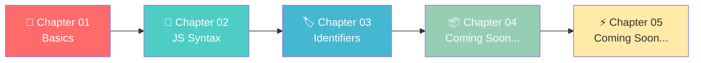
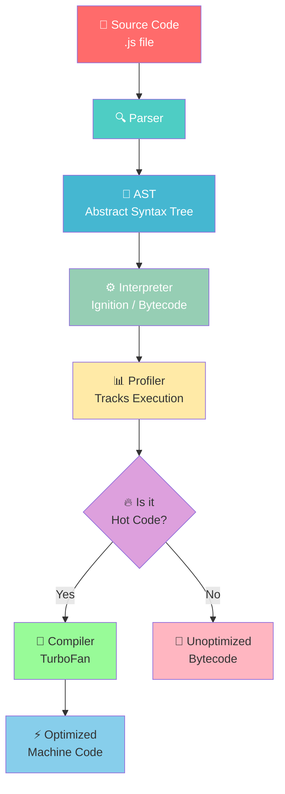
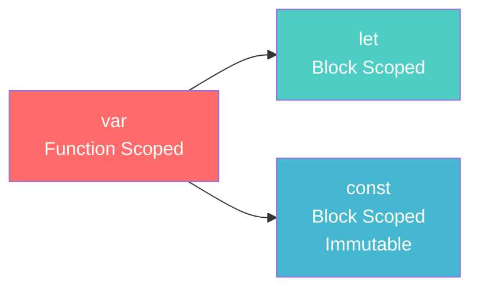
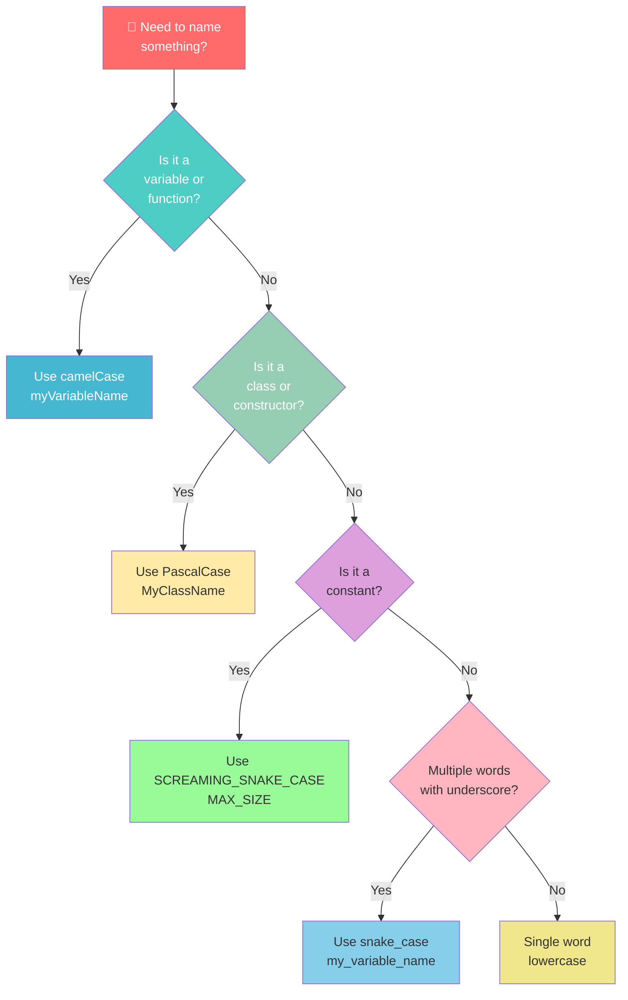

<div align="center">

# 🎭 PlaywrightWithAI

### *Master JavaScript Fundamentals — One Chapter at a Time!*

[](https://developer.mozilla.org/en-US/docs/Web/JavaScript)
[](https://nodejs.org/)
[](https://playwright.dev/)
[](LICENSE)

</div>

---

## 🌟 Welcome!

Welcome to **PlaywrightWithAI** — a hands-on, chapter-by-chapter learning repository that takes you from JavaScript basics to advanced concepts. Whether you're just starting out or brushing up on fundamentals, this repo is structured to make your learning journey **progressive**, **interactive**, and **fun**! 🚀

---

## 📚 Learning Roadmap



---

## 📂 Repository Structure

| 📁 Chapter | 🗂️ Folder | 📝 Description |
|:----------:|:----------|:--------------|
| **Chapter 01** | `chapter_01_Basics` | Variables, `console.log`, hot code optimization 🔥, and Node.js setup verification |
| **Chapter 02** | `chapter_02_JavaScript_Basics` | Core JS syntax — `var`, reassignment, and logging |
| **Chapter 03** | `chapter_03_Identifierand _literal` | Naming rules, conventions, comments 💬, and VS Code shortcuts ⌨️ |

---

## 🚀 Quick Start

### Prerequisites
- ✅ [Node.js](https://nodejs.org/) installed (v14 or higher recommended)
- ✅ A code editor (VS Code recommended)
- ✅ Curiosity to learn! 🧠

### Running Examples

Each chapter contains standalone `.js` files. Open your terminal and run:

```bash
# 🎯 Chapter 01 — Basics
node chapter_01_Basics/01_Basics.js
node chapter_01_Basics/02_HotCode.js
node chapter_01_Basics/03_Js_Verify_Setup.js

# 📘 Chapter 02 — JavaScript Basics
node chapter_02_JavaScript_Basics/05_JS_Basics.js

# 🏷️ Chapter 03 — Identifiers & Literals
node "chapter_03_Identifierand _literal/06_Identifier_Rules.js"
node "chapter_03_Identifierand _literal/js_Identifier_rule.js"
```

> 💡 **Pro Tip:** Use the VS Code shortcut cheat sheets in Chapter 03 to speed up your workflow!

---

## 🔍 Chapter Deep Dive

### 📗 Chapter 01 — Basics
> *"Every expert was once a beginner."* 🌱

| File | What You'll Learn |
|:-----|:-----------------|
| `01_Basics.js` | 🧮 Declaring variables with `let`, printing with `console.log` |
| `02_HotCode.js` | 🔥 How JS engines optimize **hot code** through the pipeline |
| `03_Js_Verify_Setup.js` | 🖥️ Checking your OS, architecture, and Node version |

#### 🔥 JavaScript Engine Optimization Pipeline

When you run JavaScript, the engine doesn't just execute line by line. It **optimizes** frequently used code! Here's how:



**💡 What's happening?**
1. **Parser** reads your code and checks for syntax errors
2. **AST** (Abstract Syntax Tree) is a tree representation of your code
3. **Interpreter** quickly generates bytecode to start execution
4. **Profiler** watches which functions run frequently
5. If code is "hot" (runs often), the **Compiler** optimizes it into fast machine code!

---

### 📘 Chapter 02 — JavaScript Basics
> *"Syntax is the grammar of programming."* 📝

| File | What You'll Learn |
|:-----|:-----------------|
| `05_JS_Basics.js` | 📦 Declaring variables with `var`, re-declaration, and console output |

#### 🎯 Variable Declaration Evolution



> ⚠️ **Best Practice:** Modern JavaScript prefers `let` and `const` over `var` to avoid scope-related bugs!

---

### 📙 Chapter 03 — Identifiers and Literals
> *"Good names make code self-documenting."* 🏷️

| File | What You'll Learn |
|:-----|:-----------------|
| `06_Identifier_Rules.js` | ✅ Valid vs ❌ Invalid identifier examples |
| `07_Identifier_part2.js` | 🎨 Naming conventions across different styles |
| `08_Comment.js` | 💬 Single-line, multi-line, and JSDoc comments |
| `js_Identifier_rule.js` | 📖 Comprehensive guide with all rules and examples |
| `VS_Code_keyboard_shortcut_mac.md` | ⌨️ macOS shortcuts cheat sheet |
| `VS_Code_keyboard_shortcut_windows.md` | ⌨️ Windows shortcuts cheat sheet |

#### 🏷️ Identifier Naming Decision Tree



#### 📋 Naming Conventions Cheat Sheet

| 🎨 Convention | 📖 Used For | 📝 Example |
|:-------------|:-----------|:----------|
| `camelCase` | Variables & Functions | `userName`, `getUserInfo()` |
| `PascalCase` | Classes & Constructors | `UserProfile`, `ShoppingCart` |
| `snake_case` | Variables (optional) | `user_name`, `total_price` |
| `SCREAMING_SNAKE_CASE` | Constants | `MAX_SIZE`, `API_KEY` |
| `Hungarian Notation` | Type-prefixed (older) | `strName`, `bActive`, `nCount` |

#### 🚦 Identifier Rules Traffic Light

| 🟢 DO | 🔴 DON'T |
|:------|:---------|
| Start with letter, `_`, or `$` | Start with a number `123var` |
| Use letters, numbers, `_`, `$` after first char | Use spaces `my var` |
| Be descriptive `totalPrice` | Use reserved words `let class` |
| Respect case sensitivity `myVar` ≠ `myvar` | Use special chars `@`, `#`, `!` |
| Use Unicode `café`, `变量` | Use hyphens `my-name` |

#### 💬 Comment Styles

```javascript
// 🟢 Single-line comment — quick notes

/*
 * 🟡 Multi-line comment — detailed explanations
 * Author: Pramod Dutta
 * Date: 14-Feb-2026
 */

/**
 * 🔵 JSDoc comment — for documentation
 * @param {string} name - The user's name
 * @returns {string} Greeting message
 */
```

---

## 📊 Topics Covered

```
✅ Variables & Data Types       ✅ JavaScript Engine Pipeline
✅ Node.js Environment          ✅ Identifier Naming Rules
✅ Naming Conventions           ✅ Code Comments & Documentation
✅ VS Code Productivity         ✅ Best Practices & Tips
```

---

## 🎯 Learning Outcomes

By the end of these chapters, you will:

- 🧠 Understand how JavaScript code is parsed and optimized
- 📝 Write clean, well-named variables and functions
- 🏷️ Apply proper naming conventions consistently
- 💬 Document your code with meaningful comments
- ⚡ Boost productivity with VS Code keyboard shortcuts
- 🖥️ Verify and troubleshoot your development environment

---

## 🛠️ Development Environment

| 🖥️ OS | 💻 Shortcut File |
|:------|:----------------|
| macOS | `VS_Code_keyboard_shortcut_mac.md` |
| Windows | `VS_Code_keyboard_shortcut_windows.md` |

> 🍎 **macOS users:** Use `Cmd` key
> 🪟 **Windows users:** Use `Ctrl` key

---

## 🤝 Contributing

We love contributions! Here's how to add a new chapter:

```
chapter_XX_<TopicName>/
  ├── 📄 README.md (optional)
  ├── <number>_TopicFile.js
  └── <number>_AnotherFile.js
```

1. 🍴 Fork the repository
2. 🌿 Create a feature branch
3. ✍️ Add your chapter with clear, commented code
4. 📤 Submit a pull request

---

## 📖 Resources

| 📚 Resource | 🔗 Link |
|:-----------|:--------|
| JavaScript MDN | [developer.mozilla.org](https://developer.mozilla.org/en-US/docs/Web/JavaScript) |
| Node.js Docs | [nodejs.org/docs](https://nodejs.org/en/docs/) |
| VS Code Shortcuts | [code.visualstudio.com](https://code.visualstudio.com/docs/getstarted/keybindings) |
| Playwright | [playwright.dev](https://playwright.dev/) |

---

<div align="center">

## ⭐ Star this repo if you found it helpful!

### Happy Coding! 🚀✨

<p align="center">
  
</p>

**Built with ❤️ for learners, by learners.**

</div>
